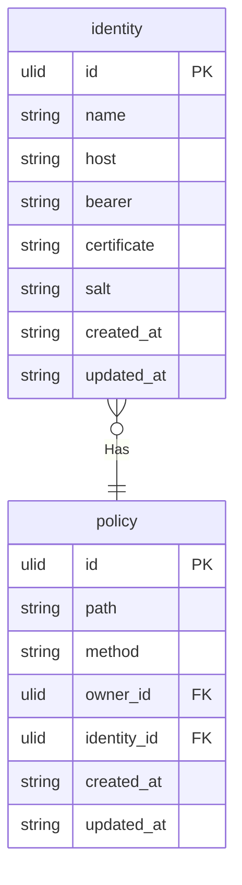

# PoliWarden
[](https://github.com/GSaiki26/poliwarden/actions/workflows/docker-build.yaml)
[](https://github.com/GSaiki26/poliwarden/actions/workflows/rust-code.yaml)

The `PoliWarden` is a gateway that enforces security policies on the incoming requests.


## Why to use? 🤔
Using `PoliWarden` as gateway to your application, you can centralize the security policies and enforce them on the incoming requests.

Defining policies in `PoliWarden` to your identities, you can ensure that only the authorized identities can access your application and only explicitly allowed actions are performed.


## How it works? 🛠️
`PoliWarden` is written in Rust, a programming language that runs blazingly fast, prevents segfaults, and guarantees thread safety.

It stores the policies and identities in a database (the database can be changed based on the enabled [features](#features-)).

When a request is received, `PoliWarden` checks the host's identifications and the request's path against the saved policies.

> [!TIP]
> The application doesn't offer much control over the requests and responses. It's just a gateway that enforces the policies.
> If you need more control over the traffic, you can use the `PoliWarden` behind a reverse proxy like Nginx.


## How to use? 🚀
First of all, the application needs a database instance to store all the policies and identities. All the possible databases and possibles protocols are listed in the [features](#features) section.

After defining the database, the environment needs to be set up. The environment variables are listed in the [configuration](#configuration-️) section.

Finally, the application can be started using `Docker`:
```bash
docker run -d -p 80:80 -env-file .env gsaiki26/poliwarden:latest
```

Or building the application from the source code:
```bash
cargo build --release -F <features>
cargo run --release

# For a HTTP server
cargo build --release -F http
```


### Identities 👤
The identities are used to identify the clients, which can be done using the bearer or the client's certificate.
The bearer is a string present in the request's header that is used to identify the client. In the application, the bearer is a BASE64 encoded string, following the format: `base64("IDENTITY_ID:IDENTITY_BEARER")`

The identities can be managed using the following endpoints:
- `GET /identities`: Returns all the identities.
- `GET /identities/:id`: Returns the identity with the given ID.
- `POST /identities`: Creates a new identity.
- `PUT /identities/:id`: Updates the identity with the given ID.
- `DELETE /identities/:id`: Deletes the identity with the given ID.


#### Creating Identities 🧑
To create an identity, a certificate can be defined. The bearer is a string that is used to identify the client. The certificate is a string that is used to identify the client using the client's certificate.

The identities can be created using the `POST /identities` endpoint. The body of the request should be as follows:
```jsonc
{
  "name": "example",
  "host": "example.com", // The host the policy'll foward the request to.
  "bearer": "A valid ulid can be passed.",
  "certificate": "-----BEGIN CERTIFICATE-----\n-----END CERTIFICATE-----"
}
```
> [!TIP]
> If the `bearer` is not defined or is empty, the identity'll automatically create a bearer. The bearer can be updated later using the `PUT /identities/:id` endpoint.


### Policies 🫸
When the application first starts, it creates the basic policies for the `master` credentials. The master identity is the one which initially can manage the policies and identities. The master credentials are defined in the [environment variables](#environment-variables-).

The policies can be managed using the following endpoints:
- `GET /policies`: Returns all the policies.
- `GET /policies/:id`: Returns the policy with the given ID.
- `POST /policies`: Creates a new policy.
- `PUT /policies/:id`: Updates the policy with the given ID.
- `DELETE /policies/:id`: Deletes the policy with the given ID.

As you should imagine, the `master` can access all the endpoints BECAUSE the initial policies are created for the master credentials. If someone else wants to access these endpoints, policies needs to be created for the wanted identity.


### Giving Access 🔓
To give access to an identity, a policy needs to be created for the identity.

The policies can be created using the `POST /policies` endpoint. The body of the request should be as follows:
```jsonc
{
  "path": "^\/user\/?$", // The path of the request. It's a regex pattern.
  "method": "^GET$", // The method of the request. It's a regex pattern.
  "owner_id": "01J3NX71DWA8P1TVSGXEBFKQ3V", // The ID of the owner. Must be a valid ULID.
  "identity_id": "01J3NX71DWZWGRZFVV1XEEXAY5" // The ID of the identity. The policy'll be applied to the identity.
}
```
> [!NOTE]
> As the path is a regex pattern, the `^` and `$` characters are used to match the start and the end of the path. So, be careful when defining the path.
> Also, defining the method as "\s" will match ALL the methods, even the ones that are not defined in the HTTP protocol. If you want to match all the HTTP methods, use the regex pattern `^(GET|POST|PUT|DELETE)$`, or the sugar syntax `^ALL$`.


### Revoking Access 🔒
To revoke the access of an identity, the policy of the identity should be updated or deleted. The policies can be deleted using the `DELETE /policies/:id` endpoint.


### Allowing management 🛡️
> [!CAUTION]
> As the `PoliWarden` uses its policies to manage who can access the management endpoints, have in mind allowing and endpoint to an identity, will give permission to manage ALL the policies and identities using the allowed endpoint.

To allow an identity to manage the policies and identities, a policy should be created for the identity.

A base identity for `PoliWarden` is created when the application first starts.
All access to the management endpoints is controlled by this identity's policies.
This identity can be found using the `master` identity on the `GET /identities` endpoint.

To simply allow an identity to use a management endpoint, a policy should be created for the identity.

For example, to allow an identity to use the `GET /policies` endpoint, a policy should be created for the identity:
```jsonc
{
  "path": "^/policies/?$",
  "method": "GET",
  "owner_id": "01J3NX71DWA8P1TVSGXEBFKQ3V", // Must be the PoliWarden's identity ID.
  "identity_id": "01J3NX71DWZWGRZFVV1XEEXAY5"
}
```


## Database 🗄️
The application uses a database to store the policies and identities. The database can be changed based on the enabled [features](#features-).

The schemas of the tables are as follows:


The `identity` stores the identities of the clients. The `policy` stores the policies of the identities. The `identity` and `policy` tables are connected with a one-to-many relationship.


## Features 💪
The application can be built with different features to enable different databases and protocols.

If you're using Docker to run the application, you can specify the features using the `--build-arg` flag:
```bash
docker build --build-arg RUST_VERSION=1.80 --build-arg FEATURES=http,https -t poliwarden:latest .
```


### Databases 🗄️
> [!WARNING]
> Just one database feature can be enabled at a time.

Currently, the following databases are available:
- `surreal`: A SurrealDB database.

If no database feature is enabled, JSON files'll be used to store the policies and identities. They'll be created as: `policy.json` and `identity.json` at `/app/vol/` directory.


### Protocols 🌐
> [!NOTE]
> By enabling multiple protocol features, ensure that the ports of the protocols are different.
> Also, if any protocol feature is enabled, the application won't start.

Currently, the following protocols are available:
- `http` (protocol): Enables the HTTP server. (Can't use the client's certificate for the identification)
- `https` (protocol): Enables the HTTPS server.


## Configuration 🛠️
### Environment Variables 📄
> An example file can be found in the [`.env.example`](.env.example) file.

The application can be configured using the following environment variables:

> [!TIP]
> Only one of the `POLIWARDEN_MASTER_BEARER` and `POLIWARDEN_MASTER_CERT` can be defined.

> [!WARNING]
> Since the `http` feature can only check the bearer, setting the `POLIWARDEN_DISABLE_BEARER`
> will make the application ignore all the requests. Including the `master` identity.

| Variable                    | Required | Default               | Description                                      |
| :-------------------------- | :------: | --------------------- | :----------------------------------------------- |
| `POLIWARDEN_LOG_LEVEL`      |    No    | `"INFO"`              | The log level of the application                 |
| `POLIWARDEN_MASTER_BEARER`  |    No    | `Ulid`                | The master bearer to access the application      |
| `POLIWARDEN_MASTER_CERT`    |    No    | `None`                | The master certificate to access the application |
| `POLIWARDEN_BEARER_HEADER`  |    No    | `"Poliwarden-Bearer"` | The header to get the bearer from the request    |
| `POLIWARDEN_DISABLE_BEARER` |    No    | `False`               | The flag to disable the bearer authentication.   |

<!-- 
### Database Environment Variables 📄
| Variable                 | Description                  |
| :----------------------- | :--------------------------- |
| `POLIWARDEN_DB_URL`      | The URL of the database      |
| `POLIWARDEN_DB_PORT`     | The port of the database     |
| `POLIWARDEN_DB_USERNAME` | The username of the database |
| `POLIWARDEN_DB_PASSWORD` | The password of the database |
| `POLIWARDEN_DB_NAME`     | The name of the database     |


### HTTP Environment Variables 📄
| Variable                       | Description                 |
| :----------------------------- | :-------------------------- |
| `POLIWARDEN_FEATURE_HTTP_PORT` | The port of the application |


### HTTPS Environment Variables 📄
| Variable                        | Description                      |
| :------------------------------ | :------------------------------- |
| `POLIWARDEN_FEATURE_HTTPS_PORT` | The port of the application      |
| `POLIWARDEN_FEATURE_HTTPS_CERT` | The path of the certificate file |
| `POLIWARDEN_FEATURE_HTTPS_KEY`  | The path of the key file         | --> |
